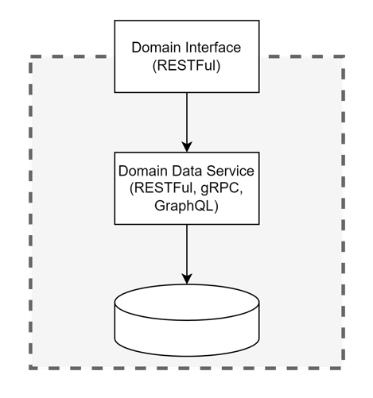

# API Program - Marketplace - Person Domain Interface

The Person Domain Interface belongs to the Developer namespace.

TBD: `https://api.pg.com/developer/v1/persons`

## What is a Domain Interface (DOI)

A DOI is the published interface for all personas (public, private, partner) to
leverage. This is considered the conanical model that represents a resource 
within a particular domain.

## How is this project organized?

This is a mono repository that will house the SDK, Types, Person packages that
are needed to standup the API Program API Marketplace Person Domain Interface.

The build system is powered by 

### Packages

* `person` - this is the Person Domain Interface. It is a published module under
the name `apip-mktpl-doi-person`
* `sdk` - a client library provided to interface with the Person DOI published
under the name `apip-mktpl-doi-person-sdk`
* `types` - a package that supplies types that are required in the SDK and
Person packages. THIS IS NOT PUBLISHED. The appropriate packages will re-export

### Standards

* We will be using conventional commits
* We will be using Semantic Releases
* A CHANGELOG will be auto-generated by the conventional commits and the
semantic release system
* Commit messages will be linted
* Files must follow the formatting standards

### Understand this workspace

Run `nx graph` to see a diagram of the dependencies of the projects.

#### Further help

* Nx - Visit the [Nx Documentation](https://nx.dev) to learn more.

#### Additional information on configuration files in root project

- .cz-config.js - This file in Nx is used to configure the Commitizen adapter for the project. Commitizen is a command line tool that helps developers standardize the format of Git commit messages. It specifies the prompts that the Commitizen adapter should use when asking the developer for information to include in a commit message. This helps to ensure that all commit messages in the project are consistent and provide the information needed to understand the changes that were made. This is a dependency taken from the NX monorepo build system.

- .eslintrc.json - This file is a configuration file for the ESLint linter. ESLint is a popular JavaScript linter that checks for potential problems in your code, such as syntax errors, coding style issues, and other potential problems. It specifies the rules that ESLint should use when checking your code, as well as any additional plugins or configurations you want to include. This allows you to customize the linting process to fit your specific needs and coding style. In TypeScript projects, it's common to extend the ESLint configuration to include rules specifically for TypeScript, to ensure that your TypeScript code is correctly linted and adheres to best practices.

- .npmrc - This file is a configuration file used by the npm (Node Package Manager) package manager. It allows you to set various configuration options for npm, such as the registry to use for downloading packages, the default access level for packages you publish, and other settings. This can be useful for managing packages in a large project or organization, as you can use the ".npmrc" file to ensure that everyone is using the same configuration options. In our usage in this repo, it sets the URL when downloading our base types (anything prefixed with @procter-gamble), and assumes you have the GITHUB_NPM_PACKAGES_TOKEN environment variable set with the contents of a Personal Access Token that is authorized for the Procter and Gable organization.

- .prettierignore - This file is a configuration file for the Prettier code formatter. It allows you to specify files or directories that should be excluded from Prettier formatting. For example, you may want to exclude generated files, minified files, or files that are managed by other tools, so that they are not accidentally modified by Prettier. It uses glob patterns to match the names of files or directories that should be ignored. For example, you can ignore all files with the ".min.js" extension, or all files in the "dist" directory. When Prettier runs, it will check this file and exclude any files or directories that match the specified patterns.

- .prettierrc - This file is a configuration file for the Prettier code formatter. It allows you to customize the behavior of Prettier to match your preferred coding style and conventions. These are the coding conventions we expect to be enforced in this repo.

- babel.config.json - This file is a configuration file for the Babel transpiler. It specifies the presets and plugins that Babel should use when transpiling your code. Presets are collections of plugins that provide support for specific syntax or features, such as the latest ECMAScript standards or React. Plugins are individual transformations that can be applied to your code, such as transforming arrow functions or destructuring. By specifying the presets and plugins here, you can ensure that your code is transpiled consistently across different environments, and that it is compatible with the platforms and browsers that you need to support. This is a dependency taken from the NX monorepo build system.

- commitlint.config.js - This file is a configuration file for the commitlint tool. It specifies the rules and conventions that commitlint should use when linting your commit messages. By specifying the rules and conventions here, you can ensure that your commit messages are written consistently and in a way that is easy to read and understand. This can help to improve the quality and maintainability of your Git history, and make it easier to collaborate with other developers on your project. This is a dependency taken from the NX monorepo build system.

- jest.config.ts - This file is a configuration file for the Jest testing framework. It specifies the configuration options for Jest, such as the root directory for tests, the test environment, the test files to be included or excluded, and the setup and teardown functions to run before and after each test. In an NX monorepo, you can have multiple applications and libraries, each with its own set of tests. To ensure that each project is tested consistently and with the correct configuration, the NX build system uses Jest to run the tests in each project according to the configuration specified here.

- jest.preset.js - This file is a Jest preset configuration file. Jest presets are pre-configured sets of Jest options that can be reused across multiple projects. It specifies the configuration options for Jest that are common to multiple projects in an NX monorepo. These options can include the test environment, the test files to be included or excluded, and the setup and teardown functions to run before and after each test.

- jest.preset.ts - This file is a Jest preset configuration file. Jest presets are pre-configured sets of Jest options that can be reused across multiple projects. It specifies the configuration options for Jest that are common to multiple projects in an NX monorepo. These options can include the test environment, the test files to be included or excluded, and the setup and teardown functions to run before and after each test.

- lint-staged.config.js - This file is a configuration file for the lint-staged package. Lint-staged is a tool that allows you to run linters (such as ESLint or Stylelint) on staged Git files, before committing your changes. This can help to ensure that your code is linted and formatted consistently, and to prevent common mistakes from being committed to your codebase. This file is an important part of the NX monorepo build system, as it provides a way to enforce coding standards and best practices, and to ensure that your code is linted and formatted consistently before it is committed to your codebase.

- nodemon.json - This file is a configuration file for the Nodemon package. This file can be used to specify which files and directories should be monitored for changes, and to configure the behavior of Nodemon when changes are detected. For example, you could specify that Nodemon should only restart the application when changes are made to specific files, or you could configure the interval at which Nodemon checks for changes.

- nx.json - This is the configuration file for the Nx (Nrwl Extensions) monorepo tool. It provides a way to configure the behavior of Nx, including the projects and libraries that are part of the monorepo, the default build and test settings, and the extensions that are used by Nx. This configuration information can be used to specify how the different projects and libraries within the monorepo should be built, tested, and deployed, and to configure the behavior of Nx extensions, such as code generators and linting tools.

- release.config.base.js - This file is a configuration file used by the Nx (Nrwl Extensions) monorepo tool. It is used to specify the settings and behavior for the release process within the monorepo. By using a release configuration file, you can specify the steps that should be taken to release a new version of your code, including the versioning scheme, the release channels, and the steps that should be taken to deploy the code to production. We use semantic-release-npm-github-publish which is a tool that helps to automate the version management of software projects by automatically generating version numbers and release notes based on the types and changes of the commits in your Git repository. By using "semantic-release-npm-github-publish", you can automate the process of publishing packages to npm and Github, based on the version numbers and release notes generated by "semantic-release".

- workspace.json - This file is a configuration file used by the Nx (Nrwl Extensions) monorepo tool. It defines the structure of the monorepo and provides information about the projects and libraries that are included within the monorepo.